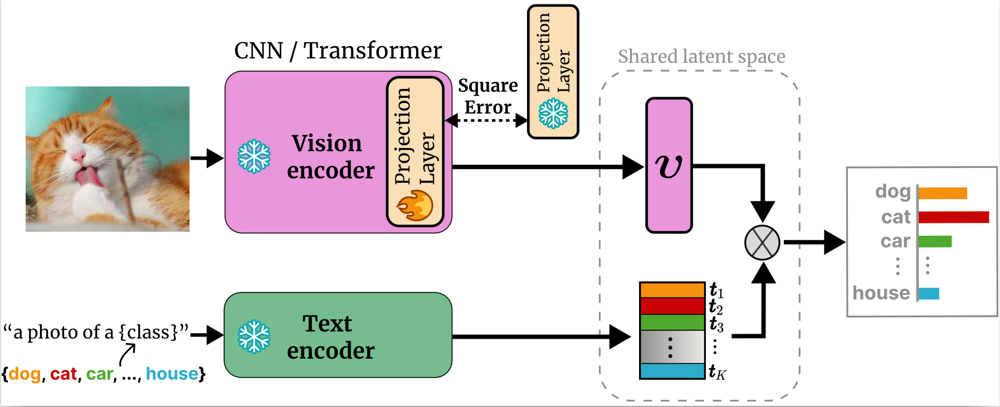
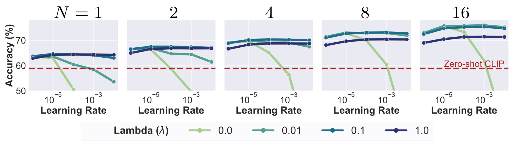
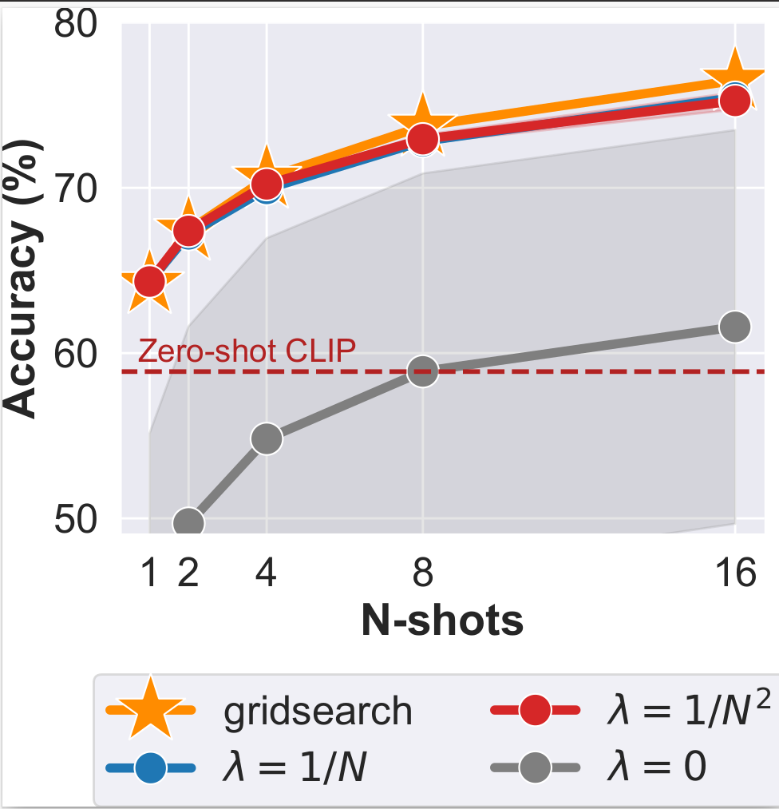
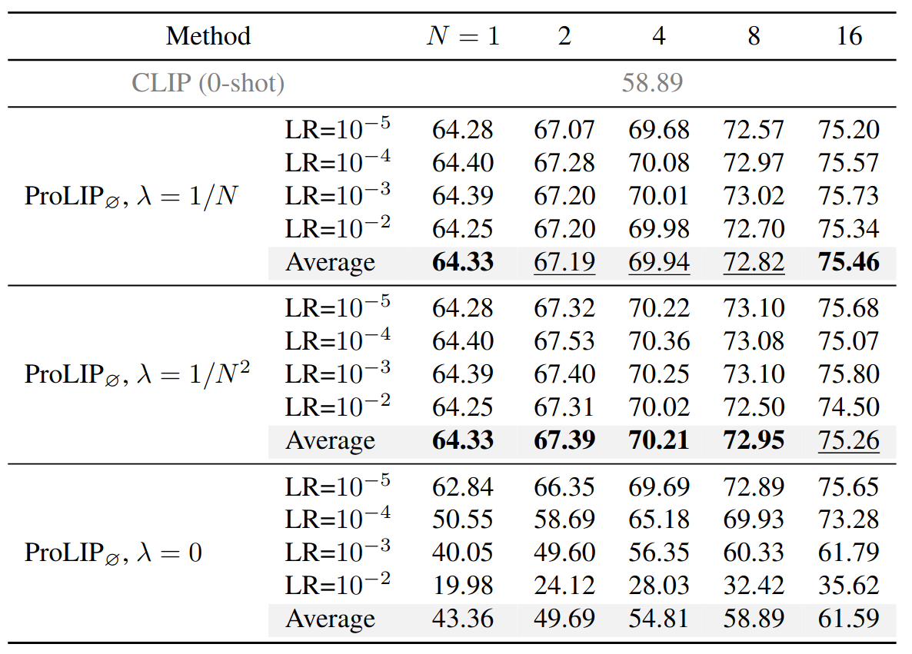
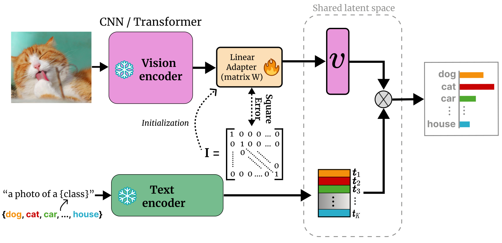
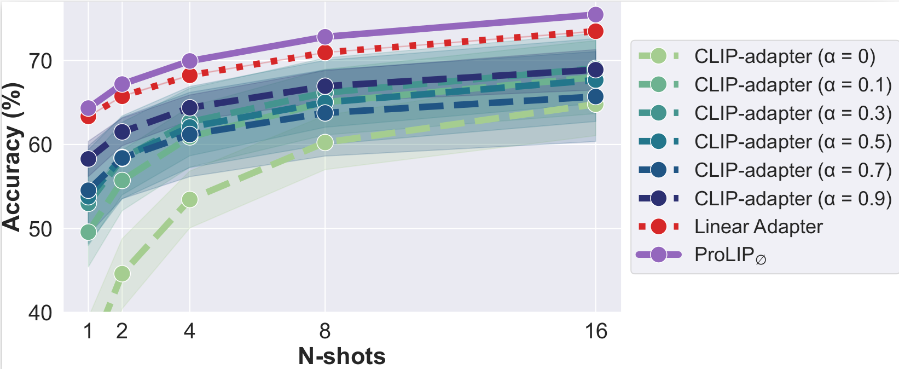

<div align='center'>

## CLIP's Visual Embedding Projector is a Few-shot Cornucopia (ProLIP)

<div>
  <a href="https://scholar.google.fr/citations?user=AcWj3loAAAAJ&hl=fr&oi=ao/">Mohammad Fahes</a><sup>1</sup>&nbsp;&nbsp;
  <a href="https://tuanhungvu.github.io/">Tuan-Hung Vu</a><sup>1,2</sup>&nbsp;&nbsp;
  <a href="https://abursuc.github.io/">Andrei Bursuc</a><sup>1,2</sup>
  <a href="https://ptrckprz.github.io/">Patrick Pérez</a><sup>3</sup>
  <a href="https://team.inria.fr/rits/membres/raoul-de-charette/">Raoul de Charette</a><sup>1</sup>
  <br>
  <sup>1</sup> Inria &nbsp;&nbsp;&nbsp; 
  <sup>2</sup> Valeo.ai &nbsp;&nbsp;&nbsp; 
  <sup>3</sup> Kyutai
</div>
<br>

[](https://arxiv.org/abs/2410.05270)


<b>TL;DR:</b> CLIP projects the visual embeddings to the shared latent space using a linear projection layer. ProLIP simply fine-tunes this layer with a zero-shot regularization loss. ProLIP is a strong alternative to linear probing, prompt tuning and CLIP-adapters, and is robust to the learning rate. It also significantely outperforms prompt tuning on test-time adaptation.

</div>

<div align="center">
  
</div>


## 🚨 Todo

- Test-time adaptation code.

# Table of Content
- [Installation](#installation)
  - [Dependencies](#dependencies)
  - [Datasets](#datasets)
- [Running ProLIP](#running-prolip)
  - [Saving Pre-projection Features](#saving-pre-projection-features)
  - [Few-shot Classification with Few-shot Validation](#few-shot-classification-with-few-shot-validation)
  - [ProLIP sensitivity to hyperparameters](#prolip-sensitivity-to-hyperparameters)
  - [Few-shot classification without validation set](#few-shot-classification-without-validation-set)
  - [Cross-dataset Generalization](#cross-dataset-generalization)
  - [Domain Generalization](#domain-generalization)
  - [Base-to-new Generalization](#base-to-new-generalization)
  - [Full FT and Last-layer FT](#full-ft-and-last-layer-ft)
  - [Complementarity to other methods](#complementarity-to-other-methods)
  - [Regularized Linear Adapter](#regularized-linear-adapter)
  - [ProLIP Text](#prolip-text)
  - [Average Accuracy](#average-accuracy)
- [Test-time Prolip](#test-time-prolip)
- [Acknowledgement](#acknowledgement)
- [Citation](#citation)


# Installation
## Dependencies
Create a conda environment and install dependencies:
```bash
git clone https://github.com/astra-vision/ProLIP.git
cd ProLIP

conda create -n prolip python=3.8
conda activate prolip

# Install the according versions of torch and torchvision
conda install pytorch torchvision cudatoolkit
```

## Datasets
Follow [DATASET.md](https://github.com/KaiyangZhou/CoOp/blob/main/DATASETS.md) to install the datasets.

# Running ProLIP
Before running ProLIP, make sure to change `root_path` in the configuration files at [`configs/experiments`](https://github.com/astra-vision/ProLIP/tree/master/configs/experiments) to the path of the datasets.

## Saving Pre-projection Features
First, start by saving the pre-projection features; i.e. the features to which the linear projection of CLIP is applied.

```
bash scripts/save_features.sh
```

You can change the backbone in [`save_features.yaml`](https://github.com/astra-vision/ProLIP/blob/master/configs/experiments/save_feat.yaml) if you want its corresponding features.

From now on, you can directly train the projection layer using these features, requiring up to 2 seconds per training.

## Few-shot Classification with Few-shot Validation
To obtain the results of few-shot classification with a few-shot validation set for hyperparameter selection (which corresponds to the setting of [`LP++`](https://arxiv.org/abs/2404.02285)), please run:

```
bash scripts/few_shot_few_val.sh
```

These experiments correspond to [**Table 1**](https://www.semanticscholar.org/paper/CLIP's-Visual-Embedding-Projector-is-a-Few-shot-Fahes-Vu/704775071c2c188f690cc5974a4b3ee6f7e204bf/figure/0), [**Table 20**](https://www.semanticscholar.org/paper/CLIP's-Visual-Embedding-Projector-is-a-Few-shot-Fahes-Vu/704775071c2c188f690cc5974a4b3ee6f7e204bf/figure/25) and [**Table 21**](https://www.semanticscholar.org/paper/CLIP's-Visual-Embedding-Projector-is-a-Few-shot-Fahes-Vu/704775071c2c188f690cc5974a4b3ee6f7e204bf/figure/26) of the paper.

## ProLIP sensitivity to hyperparameters
To obtain the results of few-shot classification for different combinations of hyperparameters (i.e. Learning rate (lr) and $\lambda$), please run:

```
bash scripts/few_shot_no_val_lr1e-6_lambda_1.sh
bash scripts/few_shot_no_val_lr1e-6_lambda_1e-1.sh
bash scripts/few_shot_no_val_lr1e-6_lambda_1e-2.sh
bash scripts/few_shot_no_val_lr1e-6_lambda_0.sh

bash scripts/few_shot_no_val_lr1e-5_lambda_1.sh
bash scripts/few_shot_no_val_lr1e-5_lambda_1e-1.sh
bash scripts/few_shot_no_val_lr1e-5_lambda_1e-2.sh
bash scripts/few_shot_no_val_lr1e-5_lambda_0.sh

bash scripts/few_shot_no_val_lr1e-4_lambda_1.sh
bash scripts/few_shot_no_val_lr1e-4_lambda_1e-1.sh
bash scripts/few_shot_no_val_lr1e-4_lambda_1e-2.sh
bash scripts/few_shot_no_val_lr1e-4_lambda_0.sh

bash scripts/few_shot_no_val_lr1e-3_lambda_1.sh
bash scripts/few_shot_no_val_lr1e-3_lambda_1e-1.sh
bash scripts/few_shot_no_val_lr1e-3_lambda_1e-2.sh
bash scripts/few_shot_no_val_lr1e-3_lambda_0.sh

bash scripts/few_shot_no_val_lr1e-2_lambda_1.sh
bash scripts/few_shot_no_val_lr1e-2_lambda_1e-1.sh
bash scripts/few_shot_no_val_lr1e-2_lambda_1e-2.sh
bash scripts/few_shot_no_val_lr1e-2_lambda_0.sh
```

Note that each of these lines corresponds to a specific combination of lr and $\lambda$. For instance `bash scripts/few_shot_no_val_lr1e-3_lambda_1e-1.sh` runs the training for lr=0.001 and $\lambda$=0.1. Each line also corresponds to 550 trainings (11 datasets, 10 support sets, 5 few-shot configurations: 1,2,4,8 and 16 shots).

Using these commands, you can obtain the results of [**Figure 3**](https://www.semanticscholar.org/paper/CLIP's-Visual-Embedding-Projector-is-a-Few-shot-Fahes-Vu/704775071c2c188f690cc5974a4b3ee6f7e204bf/figure/3) and [**Table 10**](https://www.semanticscholar.org/paper/CLIP's-Visual-Embedding-Projector-is-a-Few-shot-Fahes-Vu/704775071c2c188f690cc5974a4b3ee6f7e204bf/figure/15) of the paper.

The results show two interesting observations: 1) Using regularization $\lambda \neq 0$ prevents severe overfitting when using high learning rates, 2) Lower $\lambda$ values are better for higher N and vice versa, and that's expected as with less data there's a higher risk of overfitting.

Thus, $\lambda$ can be simply chosen as a decreasing function of N.

<div align="center">
  
</div>

## Few-shot classification without validation set
To obtain the results of few-shot classification **without validation set**; for different learning rates (lr) and $\lambda = \frac{1}{N}$ (where N is the number of shots), please run:

```
bash scripts/few_shot_no_val_lr1e-5_lambda_1_N.sh
bash scripts/few_shot_no_val_lr1e-4_lambda_1_N.sh
bash scripts/few_shot_no_val_lr1e-3_lambda_1_N.sh
bash scripts/few_shot_no_val_lr1e-2_lambda_1_N.sh
```

To obtain the results of the same **validation-free** setting using $\lambda = \frac{1}{N^2}$, please run:

```
bash scripts/few_shot_no_val_lr1e-5_lambda_1_N2.sh
bash scripts/few_shot_no_val_lr1e-4_lambda_1_N2.sh
bash scripts/few_shot_no_val_lr1e-3_lambda_1_N2.sh
bash scripts/few_shot_no_val_lr1e-2_lambda_1_N2.sh
```

Using these commands, you can obtain the results of [**Table 2**](https://www.semanticscholar.org/paper/CLIP's-Visual-Embedding-Projector-is-a-Few-shot-Fahes-Vu/704775071c2c188f690cc5974a4b3ee6f7e204bf/figure/2) and [**Table 11**](https://www.semanticscholar.org/paper/CLIP's-Visual-Embedding-Projector-is-a-Few-shot-Fahes-Vu/704775071c2c188f690cc5974a4b3ee6f7e204bf/figure/16) of the paper.

When using $\lambda$ that is inversly proportional to N, the results are stable across learning rate and almost match grid search results, yet **without any valdiation set**.

<div align="center" style="display: flex; justify-content: center; align-items: center;">
  
  
</div>

## Cross-dataset Generalization
To obtain the results of cross-dataset generalization, i.e. training on 4-shot imagenet in the **validation-free** setting and testing on the other 10 datasets, first train using:

```
bash scripts/train_4_shot_imagenet.sh
```

(Note: No need to run the script above if you have already run [`bash scripts/few_shot_no_val_lr1e-5_lambda_1_N.sh`](https://github.com/astra-vision/ProLIP/blob/master/scripts/few_shot_no_val_lr1e-5_lambda_1_N.sh) and have set `save_checkpoints` to `True` in [`configs/experiments/few_shot_no_val_lr1e-5_lambda_1_N.yaml`](https://github.com/astra-vision/ProLIP/blob/master/configs/experiments/few_shot_no_val_lr1e-5_lambda_1_N.yaml))

Then test on the other datasets:

```
bash scripts/cross_dataset.sh
```

Using these commands, you can obtain the results of [**Table 3**](https://www.semanticscholar.org/paper/CLIP's-Visual-Embedding-Projector-is-a-Few-shot-Fahes-Vu/704775071c2c188f690cc5974a4b3ee6f7e204bf/figure/4) of the paper.


## Domain Generalization
To obtain the results of domain generalization; i.e. training on 4-shot imagenet and testing on ImageNet-A, ImageNet-R, Imagenet-V2 and Imagenet-Sketch, first save the features corresponding to each backbone:

```
bash scripts/save_features_IN_RN50.sh
bash scripts/save_features_IN_RN101.sh
bash scripts/save_features_IN_VITB16.sh
bash scripts/save_features_IN_VITB32.sh
```

(Note: No need to run [`bash scripts/save_features_IN_RN50.sh`](https://github.com/astra-vision/ProLIP/blob/master/scripts/save_features_IN_RN50.sh) if you have already run [`bash scripts/save_features.sh`](https://github.com/astra-vision/ProLIP/blob/master/scripts/save_features.sh))

Then train the models using:

```
bash scripts/train_4_shot_imagenet.sh
bash scripts/DG_RN101.sh
bash scripts/DG_VITB16.sh
bash scripts/DG_VITB32.sh
```

(Note: No need to run [`bash scripts/train_4_shot_imagenet.sh`](https://github.com/astra-vision/ProLIP/blob/master/scripts/train_4_shot_imagenet.sh) if you have already run [`bash scripts/few_shot_no_val_lr1e-5_lambda_1_N.sh`](https://github.com/astra-vision/ProLIP/blob/master/scripts/few_shot_no_val_lr1e-5_lambda_1_N.sh) and have set `save_checkpoints` to `True` in [`configs/experiments/few_shot_no_val_lr1e-5_lambda_1_N.yaml`](https://github.com/astra-vision/ProLIP/blob/master/configs/experiments/few_shot_no_val_lr1e-5_lambda_1_N.yaml))

This will automatically output the results on the out-of-distribution variants. Using these commands, you can obtain the results of [**Table 4**](https://www.semanticscholar.org/paper/CLIP's-Visual-Embedding-Projector-is-a-Few-shot-Fahes-Vu/704775071c2c188f690cc5974a4b3ee6f7e204bf/figure/5) of the paper.


## Base-to-new Generalization
To obtain the results of base-to-new generalization for 4-shot training on RN50, first train on base classes in the **validation-free** setting:

```
bash scripts/base_to_new_RN50.sh
```

This will train ProLIP on the base classes and test on the corresponding test sets.

To evaluate the trained models on new classes, please run:

```
bash scripts/new_classes_eval_RN50.sh
```

To obtain the results of base-to-new generalization for 16-shot training on ViT-B/16, first save the features if it has not already been done:

```
bash scripts/save_features_16_shot_VITB16.sh
```

Then train on base classes in the **validation-free** setting:

```
bash scripts/base_to_new_VITB16.sh
```

Finally evaluate the trained models on new classes:

```
bash scripts/new_classes_eval_VITB16.sh
```

Using these commands, you can obtain the results of [**Table 5**](https://www.semanticscholar.org/paper/CLIP's-Visual-Embedding-Projector-is-a-Few-shot-Fahes-Vu/704775071c2c188f690cc5974a4b3ee6f7e204bf/figure/7), [**Table 14**](https://www.semanticscholar.org/paper/CLIP's-Visual-Embedding-Projector-is-a-Few-shot-Fahes-Vu/704775071c2c188f690cc5974a4b3ee6f7e204bf/figure/19) and [**Table 15**](https://www.semanticscholar.org/paper/CLIP's-Visual-Embedding-Projector-is-a-Few-shot-Fahes-Vu/704775071c2c188f690cc5974a4b3ee6f7e204bf/figure/20) of the paper.

⚠️⚠️**Note**: Using "a photo of a {}." instead of the dataset-specific templates in ([datasets](https://github.com/astra-vision/ProLIP/tree/master/datasets)) improves base-to-new generalization performance for ViT-B/16 trained in the 16-shot setting. New results are in the table below for comparison.

| Method   | Trainable Parameters |  Base Accuracy   |   Novel Accuracy  |   Harmonic Mean   |
| :---------------: | :---------------: | :---------------: | :---------------: | :---------------: |
| [CLIP](https://arxiv.org/abs/2103.00020)       | 0.00M  | 69.34 | 74.22 | 71.70 |
| [CoOp](https://arxiv.org/abs/2109.01134)       | 0.002M  | 82.69 | 63.22 | 71.66 |
| [CoCoOp](https://arxiv.org/abs/2203.05557)     | 0.035M  | 80.47 | 71.69 | 75.83 |
| [MaPLe](https://arxiv.org/abs/2210.03117)      | 3.55M  | 82.28 | **75.14** | 78.55 |
| ProLIP (ours) | 0.39M | **84.01** | 73.86 | 78.61 |
| ProLIP (ours) w/ "a photo of a {}." | 0.39M | 83.90 | 74.78 | **79.08**

## Full FT and Last-layer FT
To obtain the results of Full fine-tuning of the vision encoder, please run:

```
bash scripts/full_ft.sh
```

To obtain the results of Last-layer fine-tuning, please run:

```
bash scripts/last_layer_ft_lr1e-5.sh
bash scripts/last_layer_ft_lr1e-4.sh
```

Using these commands, you can obtain the results of [**Table 6**](https://www.semanticscholar.org/paper/CLIP's-Visual-Embedding-Projector-is-a-Few-shot-Fahes-Vu/704775071c2c188f690cc5974a4b3ee6f7e204bf/figure/9) of the paper.


## Complementarity to other methods
To obtain the results of combining the logits of ProLIP and those of [`Tip-Adapter-F`](https://arxiv.org/abs/2111.03930) in the **validation-free** setting, please run:

```
bash scripts/prolip_tip.sh 
```

To obtain the results of combining the logits of ProLIP and those of [`TaskRes`](https://arxiv.org/abs/2211.10277) in the **validation-free** setting, please run:

```
bash scripts/prolip_taskres.sh
```

Using these commands, you can obtain the results of [**Table 7**](https://www.semanticscholar.org/paper/CLIP's-Visual-Embedding-Projector-is-a-Few-shot-Fahes-Vu/704775071c2c188f690cc5974a4b3ee6f7e204bf/figure/11) of the paper.


## Regularized Linear Adapter

To obtain the results of CLIP-adapter with different learning rate (lr) and residual ratio ($\alpha$) values, please run:

```
bash scripts/CA_lr1e-5_alpha_0.sh
bash scripts/CA_lr1e-4_alpha_0.sh
bash scripts/CA_lr1e-3_alpha_0.sh
bash scripts/CA_lr1e-2_alpha_0.sh

bash scripts/CA_lr1e-5_alpha_1e-1.sh
bash scripts/CA_lr1e-4_alpha_1e-1.sh
bash scripts/CA_lr1e-3_alpha_1e-1.sh
bash scripts/CA_lr1e-2_alpha_1e-1.sh

bash scripts/CA_lr1e-5_alpha_3e-1.sh
bash scripts/CA_lr1e-4_alpha_3e-1.sh
bash scripts/CA_lr1e-3_alpha_3e-1.sh
bash scripts/CA_lr1e-2_alpha_3e-1.sh

bash scripts/CA_lr1e-5_alpha_5e-1.sh
bash scripts/CA_lr1e-4_alpha_5e-1.sh
bash scripts/CA_lr1e-3_alpha_5e-1.sh
bash scripts/CA_lr1e-2_alpha_5e-1.sh

bash scripts/CA_lr1e-5_alpha_7e-1.sh
bash scripts/CA_lr1e-4_alpha_7e-1.sh
bash scripts/CA_lr1e-3_alpha_7e-1.sh
bash scripts/CA_lr1e-2_alpha_7e-1.sh

bash scripts/CA_lr1e-5_alpha_9e-1.sh
bash scripts/CA_lr1e-4_alpha_9e-1.sh
bash scripts/CA_lr1e-3_alpha_9e-1.sh
bash scripts/CA_lr1e-2_alpha_9e-1.sh
```
To obtain the results of our proposed regularized linear adapter in the **validation-free** setting using $\lambda = \frac{1}{N}$, please run:
```
bash scripts/RLA_lr1e-5_lambda_1_N.sh
bash scripts/RLA_lr1e-4_lambda_1_N.sh
bash scripts/RLA_lr1e-3_lambda_1_N.sh
bash scripts/RLA_lr1e-2_lambda_1_N.sh
```

<div align="center">
  
</div>

Using these commands, you can obtain the results of [**Figure 4**](https://www.semanticscholar.org/paper/CLIP's-Visual-Embedding-Projector-is-a-Few-shot-Fahes-Vu/704775071c2c188f690cc5974a4b3ee6f7e204bf/figure/6) and [**Table 16**](https://www.semanticscholar.org/paper/CLIP's-Visual-Embedding-Projector-is-a-Few-shot-Fahes-Vu/704775071c2c188f690cc5974a4b3ee6f7e204bf/figure/21) of the paper.

The results help rethinking CLIP-adapter from the perspective of ProLIP, and show that the regularized linear adapter 1) outperforms the classical non-linear adapter, 2) alleviates the need of architecture design and hyperparameter selection, and 3) exhibits stable performance across different learning rates.

<div align="center">
  
</div>

## ProLIP Text
To obtain the results of ProLIP applied to the text embedding projection layer in the **validation-free** setting, for different learning rate and with $\lambda=\frac{1}{N}$, please run:

```
bash scripts/prolip_text_lr1e-5_lambda_1_N.sh
bash scripts/prolip_text_lr1e-4_lambda_1_N.sh
bash scripts/prolip_text_lr1e-3_lambda_1_N.sh
bash scripts/prolip_text_lr1e-2_lambda_1_N.sh
```

Using these commands, you can obtain the results of [**Table 8**](https://www.semanticscholar.org/paper/CLIP's-Visual-Embedding-Projector-is-a-Few-shot-Fahes-Vu/704775071c2c188f690cc5974a4b3ee6f7e204bf/figure/13) and [**Table 13**](https://www.semanticscholar.org/paper/CLIP's-Visual-Embedding-Projector-is-a-Few-shot-Fahes-Vu/704775071c2c188f690cc5974a4b3ee6f7e204bf/figure/18) of the paper.

## Average Accuracy

Running any of the trainings above will output `.txt` files containing the average accuracy over 10 seeds per dataset, and per value of N (i.e. Number of shots). To compute the average accuracy over the 11 datasets, please run:

```
python results/mean_std.py --acc_path <path_to_the_accuracy_values>
```

# Test-time Prolip
🚨 Todo: I will add the code soon.

# Acknowledgement
This work was partially funded by French project SIGHT (ANR-20-CE23-0016). It was performed using HPC resources from GENCI–IDRIS (Grants AD011014477R1, AD011012808R3). The authors thank Clément Weinreich for insightful discussion.
This repository is built on top of [`LP++`](https://github.com/FereshteShakeri/FewShot-CLIP-Strong-Baseline), [`Tip-adapter`](https://github.com/gaopengcuhk/Tip-Adapter), and [`CLIP`](https://github.com/openai/CLIP). Thanks to the authors for making their work open-source!

# Citation
```
@misc{fahes2025clipsvisualembeddingprojector,
      title={CLIP's Visual Embedding Projector is a Few-shot Cornucopia}, 
      author={Fahes, Mohammad and Vu, Tuan-Hung and Bursuc, Andrei and P\'erez, Patrick and de Charette, Raoul},
      year={2025},
      eprint={2410.05270},
      archivePrefix={arXiv},
      primaryClass={cs.CV},
      url={https://arxiv.org/abs/2410.05270}, 
}
```
---

[🢁 jump to top](#clips-visual-embedding-projector-is-a-few-shot-cornucopia-prolip)
