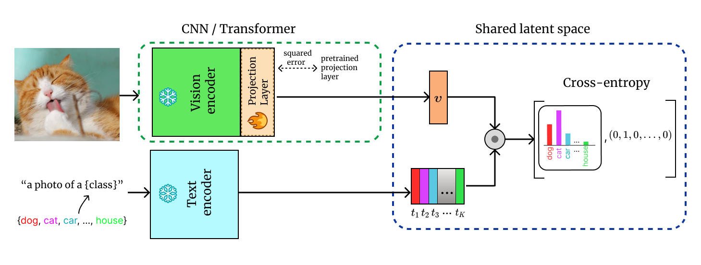

# Fine-tuning CLIP's Last Visual Projector: A Few-Shot Cornucopia
[Mohammad Fahes1](https://mfahes.github.io/),
[Tuan-Hung Vu1,2](https://tuanhungvu.github.io/),
[Andrei Bursuc1,2](https://abursuc.github.io/),
[Patrick Pérez3](https://ptrckprz.github.io/),
[Raoul de Charette1](https://team.inria.fr/rits/membres/raoul-de-charette/) 
1 Inria, Paris, France.

2 valeo.ai, Paris, France.

3 Kyutai, Paris, France. 

TL; DR: CLIP projects visual embedding to the shared latent space using a linear projection layer. We show that simply fine-tuning this guy (:p) can be a strong alternative to linear probing, prompt tuning and CLIP-adapters, and performs also well on test-time adaptation.

Stay tuned for the code!

## ProLIP

  <b>We fine-tune the pretrained linear projection layer of the vision encoder with a regularization loss towards the pre-trained weights.</b>

  

